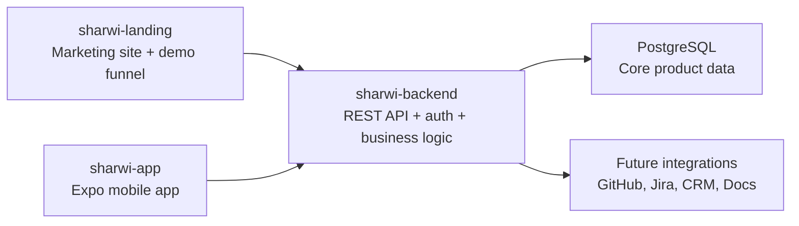
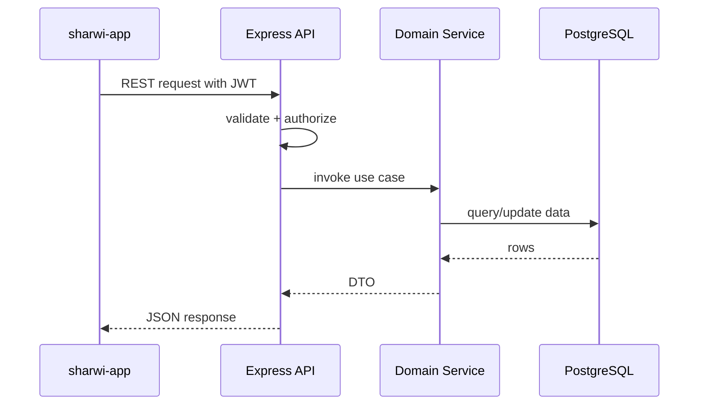
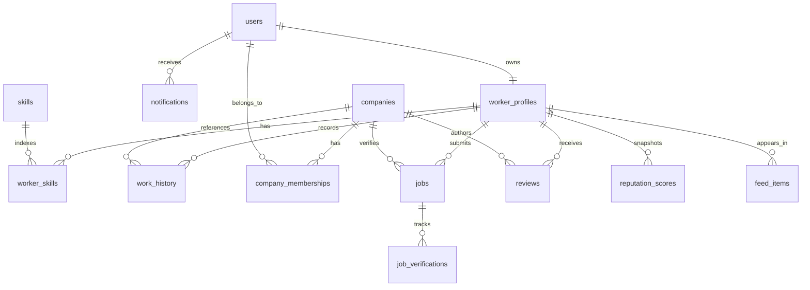

# Sharwi System Architecture

## Tech Stack

### sharwi-landing

- Next.js 14
- React
- TypeScript
- Tailwind CSS

### sharwi-app

- Expo
- React Native
- TypeScript
- Expo Router
- React Query
- Zustand

### sharwi-backend

- Node.js
- Express
- TypeScript
- PostgreSQL
- `pg`
- JWT authentication
- Docker

## Architecture Overview



## Repository Structure

```text
sharwi/
  app/                  # existing landing repo (Next.js app router)
  components/
  lib/
  docs/
  sharwi-app/           # new Expo app
  sharwi-backend/       # new Node/Express API
```

## Backend Architecture

### Layering

- `routes`: express route definitions
- `controllers`: request/response mapping
- `services`: business rules and orchestration
- `repositories`: SQL access
- `db`: client, migrations, seed helpers
- `middleware`: auth, error handling, validation
- `schemas`: zod request/response validation

### Module Boundaries

- auth
- users
- worker-profiles
- companies
- jobs
- reviews
- reputation
- feed
- notifications

### Request Lifecycle



## Frontend Architecture

### Landing

- Keeps demo funnel, storytelling, and request-demo conversion.
- Explains the verified worker reputation and discovery system more clearly.

### Mobile App

- Expo Router drives route structure.
- React Query handles server state and caching.
- Zustand handles session, drafts, and lightweight UI state.
- Shared typed models mirror backend response DTOs.
- UI is composed from reusable primitives and domain cards.

### Mobile Navigation

- Auth stack
- Main tabs
- Modal/detail routes

Proposed tabs:

- Feed
- Discover
- Reputation
- Notifications
- Profile

## Database Schema

### Core Tables

- `users`
- `worker_profiles`
- `skills`
- `worker_skills`
- `companies`
- `company_memberships`
- `work_history`
- `jobs`
- `job_verifications`
- `reviews`
- `reputation_scores`
- `feed_items`
- `notifications`

### Entity Relationships



## Authentication Strategy

- Email/password registration and login for MVP.
- JWT access tokens with short TTL.
- Refresh token rotation stored in `httpOnly` cookies for web clients later; mobile MVP can use secure token storage with refresh endpoint.
- Password hashing with `bcryptjs`.
- Role claims embedded in JWT: `worker`, `company_member`, `company_admin`, `platform_admin`.

## API Structure

### Auth

- `POST /auth/register`
- `POST /auth/login`
- `GET /auth/me`

### Worker Profiles

- `GET /workers`
- `GET /workers/:id`
- `GET /workers/me`
- `PUT /workers/me`
- `POST /workers/me/skills`

### Jobs and Verification

- `POST /jobs`
- `POST /jobs/verify`
- `GET /jobs/:id`

### Reviews

- `POST /reviews`
- `GET /workers/:id/reviews`

### Feed and Notifications

- `GET /feed`
- `GET /notifications`
- `POST /notifications/:id/read`

## Deployment Strategy

### Landing

- Deploy on Vercel.

### Backend

- Dockerized Express service.
- Deploy on Render, Railway, Fly.io, or ECS/Fargate later.
- Managed PostgreSQL in Supabase, Neon, RDS, or Railway Postgres.

### Mobile

- Expo EAS builds for iOS and Android.
- Environment-based API URL switching.

### Operational Readiness

- Structured logs
- Health check endpoint
- Database migrations run in CI/CD
- Secrets managed per environment
- Future additions: rate limiting, Sentry, OpenTelemetry, background jobs
